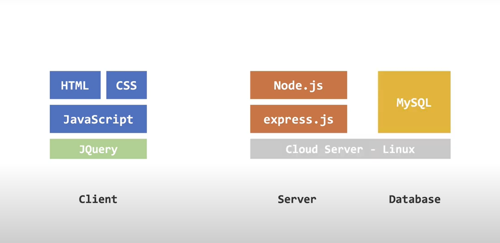

# Chat Room

This repository contains the code for a chat room application developed. The application allows students in one course to communicate with their classmates and instructors through a real-time messaging system. Below, you will find an overview of the application, the technologies used, and the code structure.

## Application Overview

The application provides a simple and user-friendly chat room interface where users can register, log in, view previous chat logs, and post new messages. It also features instant message updates for all users in the chat room.

### Login Page

Users can access the login page, where they have the option to register a new account or log in using existing credentials.

To register a new account, follow these steps:
1. Enter a desired username.
2. Set a password for the account.
3. Click the "Register" button to create the account.

Once registered, users can log in using their credentials to access the chat room.

### Chat Room

Upon logging in, users are directed to the chat room page. In the chat room, users can:
- View previous chat logs from professors and classmates.
- Post new messages that will be visible to all participants.

To post a message, simply type your message in the input box and click the "Post" button. After posting, the new message will appear on the chat board, and all other users logged into the chat room will see the message simultaneously.

## Technologies Used

The application utilizes the following technologies:

### Client

The frontend of the application is built using standard web stack:
- HTML
- CSS
- JavaScript

Additionally, the application incorporates the JQuery library for HTML document traversal and manipulation.

### Server

The backend of the application is developed using the following technologies:
- Node.js
- Express.js

The communication between the server and the client is established using Socket.IO, a real-time bi-directional event-based communication mechanism that ensures low-overhead communication.

## Code Structure

The code structure of the application is as follows:

### Client

- `common.js`: Defines the HTML and CSS for the two interfaces (login and chat) and the styles for all elements in the interfaces.

The login interface mainly contains the information submission form, while the chat interface includes the chat log (loaded automatically upon entering the page) and the input box for posting messages. It also specifies how Socket.IO sends a message event to the backend and receives responses from the backend.

### Server

- `www`: Sets the port and responds to Socket.IO events.
- `app.js`: The main web application file responsible for configuration.
- `sql.js`: Sets up the database connection.

Additionally, there are two routing files that specify routing rules and database operations.

## Installation and Usage

To use the chat room application locally, follow these steps:

1. Clone the repository from GitHub.
2. Install the necessary dependencies using Node Package Manager (npm).
3. Set up the MySQL database to work with the application.
4. Run the application using Node.js.

## Demo

Click to view the video introduction.

